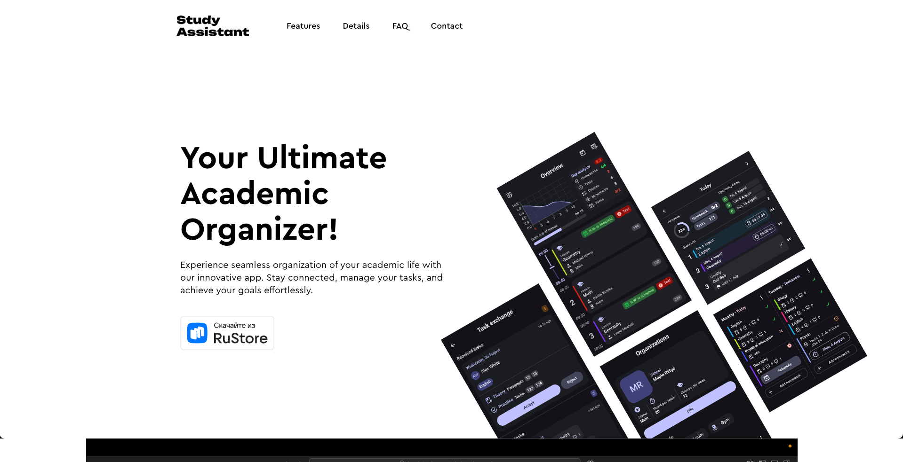

# 🌐 StudyAssistant Web

<p align="start">
  
  
</p>

---

## 📖 About

**StudyAssistant Web** is the official landing page for the [StudyAssistant mobile app](https://github.com/v1tzor/StudyAssistant). This website provides:

- 📱 Screenshots & features overview of the app  
- 📄 Documentation and download links  
- 🔗 Redirects to app marketplaces (Play Store, AppGallery, RuStore, etc.)  
- 📰 Changelog, FAQs, and contact information  

Built using **Next.js** this site is fast, responsive, and SEO-friendly.

---

## 🚀 Features

- ⚡️ **Blazing-fast** performance with Next.js static optimization  
- 🌙 **Light/Dark mode** support (follows system preference)  
- 📱 **Responsive** design for mobile, tablet, and desktop  
- 🌍 **i18n ready** – prepared for multiple language support  
- 🛠️ Fully customizable and extensible  
- ☁️ Hosted on **Github pages** for reliable CI/CD and deployments  

---

## 📸 Preview

<p align="center">
  
</p>

---

## 📁 Project Structure

```bash
studyassistant-web/
├── public/
├── components/
├── pages/ 
├── locales/
├── recovery/
├── verify/         
├── global-context.js
├── next.config.js
├── middleware.js
├── jsconfig.json
└── README.md
```

---

## 🧑‍💻 Development

### 1. Clone the repo

```bash
git clone https://github.com/v1tzor/studyassistant-web.git
cd studyassistant-web
```

### 2. Install dependencies

```bash
npm install
# or
yarn install
```

### 3. Run locally

```bash
npm run dev
# or
yarn dev
```

Then visit [http://localhost:3000](http://localhost:3000) 🚀

---

## 🌍 Live Site

[studyassistant-app.ru](https://studyassistant-app.ru/) – Official Website

---

## 📜 License

```
Copyright 2025 Stanislav Aleshin

Licensed under the Apache License, Version 2.0 (the "License");
you may not use this file except in compliance with the License.
You may obtain a copy of the License at

http://www.apache.org/licenses/LICENSE-2.0

Unless required by applicable law or agreed to in writing, software
distributed under the License is distributed on an "AS IS" BASIS,
WITHOUT WARRANTIES OR CONDITIONS OF ANY KIND, either express or implied.
See the License for the specific language governing permissions and
limitations under the License.
```

---

🔗 Looking for the app? Visit the [StudyAssistant mobile repository](https://github.com/v1tzor/StudyAssistant)